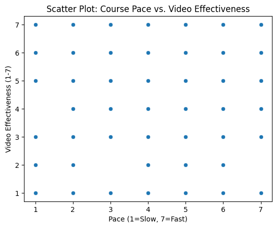
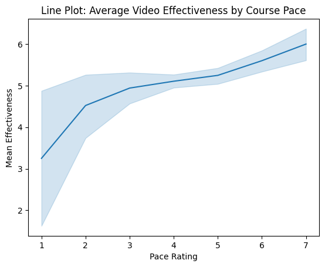
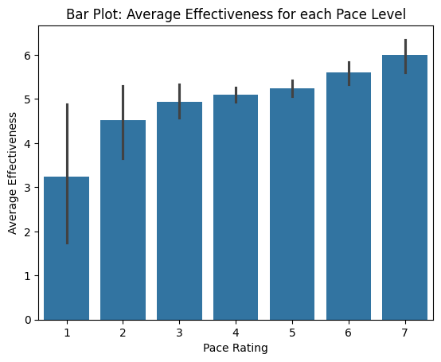

---
# Do not edit the text between these lines!
layout: default
---

# Exercise 09!

## Project Summary
In this project, I analyzed how COMP 110 can be improved to create more value for students. By looking at survey data, I explored whether students who find the class fast-paced are more likely to find video resources helpful. My goal was to see if adding recorded lectures would provide a necessary safety net for students.

---

## My Idea: Recorded Lecture Videos
The course should post recorded lecture videos for students who didn't understand everything in the large lecture hall. This creates value for students by providing flexibility. It allows them to go back on their own time to better understand difficult content that might have moved too quickly during the live session.

---

## Data Analysis
I performed an analysis to see if students who feel the course moves quickly are the ones who find video learning most effective.

### 1. Course Pace vs. Video Effectiveness (Scatter Plot)
This scatter plot shows every student's response. We can see that many students who rated the pace as a 6 or 7 also gave a high rating for the effectiveness of lesson videos.

### 2. Trends in Student Support (Line Plot)
The line plot shows the average effectiveness rating across different pace levels. There is a visible upward trend, meaning as the pace gets faster, the perceived value of video resources increases.

### 3. Average Effectiveness by Pace (Bar Plot)
This bar plot compares the average effectiveness score for each group. It clearly shows that the students in the "Fastest Pace" category rely most heavily on video-based instruction.

---

## Final Conclusions

### Summary of Findings
My analysis supported my idea. The data shows that students who find the course pace to be "Quick" or "Very Quick" consistently rate video effectiveness higher than those who find the course slow. This suggests that recorded lectures would be a highly valuable resource for the students who are currently struggling to keep up.

### Trade-offs and Downsides
While recorded lectures are helpful, a major trade-off is that they might lead to lower attendance in the live lectures. If students stay home to watch recordings, the classroom environment loses the energy and live questions that make the course engaging. Additionally, it requires extra work from the instructional staff to record and upload every session.

### Future Extensions
In the future, instead of recording the full 75-minute lecture, we could create "Mini-Recap" videos. These would be 5-10 minute videos that only cover the hardest concepts from that day. This would provide the review value students need without the downsides of long videos and lower attendance.